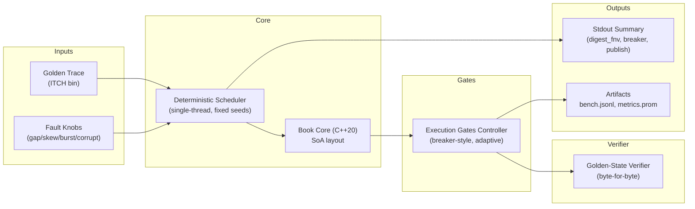
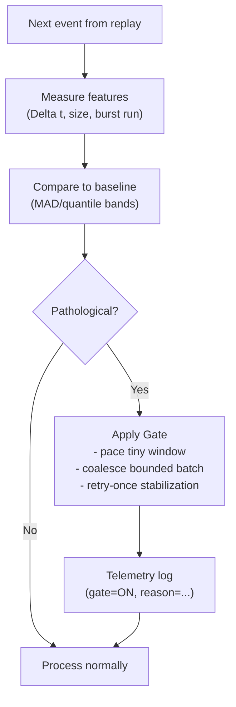
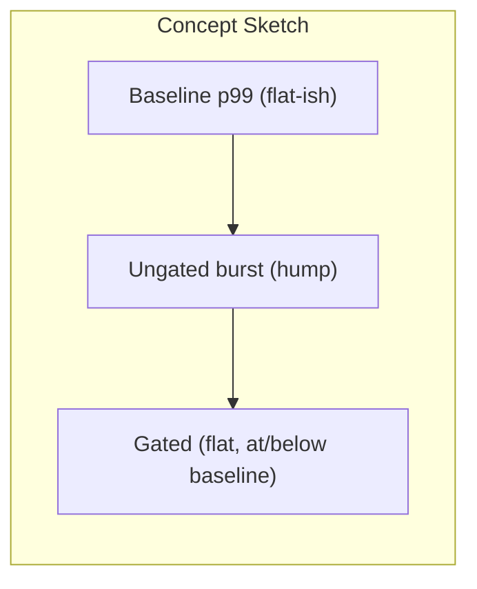

# Blanc Quant LOB Engine (BQL Engine)

<!-- DO NOT REMOVE: Visitors badge for repo analytics -->


Blanc LOB Engine is a replay and benchmarking harness for HFT-style order books, designed for:

- **Deterministic replay:** Byte-for-byte golden-state checks over ITCH binaries and synthetic bursts.
- **Dynamic Execution Gates (DEG, patent-pending):** Breaker-style gate policies wrap the datapath with explicit safety and tail-latency controls. (Open-source includes a simple breaker state machine; advanced DEG features are proprietary.)
- **Tail SLO enforcement:** `scripts/verify_bench.py` enforces p50/p95/p99 latency budgets as release gates.
- **Structured observability:** Every run emits JSONL and Prometheus-compatible text files for diffing, dashboards, and CI.

The public repo focuses on deterministic replay, golden-state input digests, and CI-enforced performance gates. Advanced gate logic and production integrations are reserved for the enterprise version and associated patent work.

If you work in low-latency trading or quant infrastructure and want to collaborate or discuss how this engine fits your team, contact me via LinkedIn. (600+ clones as of 12/07/25).

Blanc LOB Engine is a **replay + benchmarking harness** for HFT-style order books, built for:

- **Deterministic replay:** Byte-for-byte golden-state checks over ITCH binaries and synthetic bursts.
- **Patent-pending Dynamic Execution Gates (DEG):** Breaker-style gate policies wrap the datapath with explicit safety and tail-latency controls.
  (Open-source release includes simple breaker state machine; ALL advanced DEG features remain proprietary.)
- **Tail SLO enforcement:** `scripts/verify_bench.py` treats p50/p95/p99 budgets as release gates, not suggestions.
- **Structured observability:** Every run emits JSONL and Prometheus-compatible text files for diffing, dashboards, and CI.

If you care about *"can we replay this exactly, under load, and prove it didn't get slower or weirder at the tails?"* this engine is the answer.

## Quickstart

```sh
cmake -S . -B build -G Ninja -DCMAKE_BUILD_TYPE=Release
cmake --build build -j
build/bin/replay --input data/golden/itch_1m.bin
```

This replays the ITCH 1M golden sample, emits `artifacts/bench.jsonl` and `artifacts/metrics.prom`, and verifies determinism against `data/golden/itch_1m.fnv`.

## What Makes This Innovative

### 1. Golden-State Deterministic Replay

- Guarantees byte-for-byte identical results across runs.
- FNV-1a digest verification: Every replay produces a cryptographic fingerprint of the final order book state.
- Automated dual-run CI: GitHub Actions runs the same input twice and fails if digests differ—catching non-determinism instantly.
- Environment normalization: Fixed timezone, locale, and compiler ensure reproducibility.

### 2. Integrated Determinism + Performance Testing

- Same workflow proves determinism and measures p50/p95/p99 tail latency.
- Release gates enforce SLO budgets: if p99 regresses, CI fails.
- Structured artifacts (`bench.jsonl`, `metrics.prom`) enable historical tracking and automated dashboards.

### 3. Dynamic Execution Gates (Patent-Pending)

- Breaker-style state machine (Fuse → Local → Feeder → Main → Kill).
- Preserves deterministic replay while containing pathological scenarios.
- Explicit publish control: corrupted runs are flagged, not silently trusted.

### 4. Telemetry-Driven Golden-State Validation

- Every run produces machine-readable, CI-auditable artifacts.
- Structured outputs: JSONL event logs + Prometheus textfiles.
- Release gates as code: `scripts/verify_bench.py` treats performance budgets as pass/fail gates.
- Artifact packaging: Automated artifact creation with provenance metadata.

### 5. Canonical Serialization for Order Books

- Structure-of-Arrays (SoA) layout for cache efficiency
- Fixed iteration order regardless of insertion sequence
- FNV-1a rolling hash captures exact state, not approximations

**Why it matters:** Most order books use hash maps or trees that produce
different orderings across runs. Canonical serialization is required for
byte-for-byte reproducibility.

## System architecture

```text
┌──────────────────────────────────────────────────────────────────────────────┐
│   BLANC LOB ENGINE — Deterministic Replay & Benchmark Harness                │
├──────────────────────────────────────────────────────────────────────────────┤
│ Inputs                              Core                           Outputs    │
│ ┌─────────────────┐        ┌──────────────────────────────┐      ┌───────────┐│
│ │ trace_loader    │───▲───▶│ Deterministic Replay         │───┬─▶│ Stdout    ││
│ │ (ITCH bin; CSV/ │   │    │ Scheduler (ST; MT optional)  │   │  │ summary   ││
│ │ PCAP→bin bridge)│   │    └──────────────┬───────────────┘   │  └───────────┘│
│ └─────────────────┘   │                   │                   │              │
│ ┌─────────────────┐   │                   │                   │  ┌───────────┐│
│ │ gen_synth       │───┘   Fault Injection / Gates (DEG‑compatible;         ││
│ │ (synthetic)     │           breaker‑style, optional)           └─▶│ Artifacts ││
│ └─────────────────┘                                     ▲            │ bench.jsonl│
│                                                         │            │ metrics.prom│
│                                         ┌──────────────────────────────┐└───────────┘│
│                                         │ Golden-state Checker         │◀──────┘
│                                         │ (byte-for-byte digest_fnv)   │
│                                         └──────────────────────────────┘
│                                                 │
│                                                 ▼
│ ┌──────────────────────────────┐     ┌──────────────────────────────┐
│ │ Benchmark Harness            │     │ Structured Observability     │
│ │ • msgs/s throughput          │     │ • JSONL event logs           │
│ │ • p50/p95/p99 latency        │     │ • Prometheus textfile        │
│ │ • config matrix sweeps       │     │ • CI artifacts (goldens)     │
│ └──────────────────────────────┘     └──────────────────────────────┘
└──────────────────────────────────────────────────────────────────────────────┘
```

### Flow summary

- ITCH binaries and synthetic `gen_synth` bursts feed a deterministic scheduler
  that enforces DEG-compatible gate policies before emitting telemetry.
- Golden digest checks ensure byte-for-byte stability, while the bench harness
  sweeps configs to publish `bench.jsonl`, Prometheus textfiles, and CI-ready
  artifacts.
- Structured observability (JSONL + textfile) makes it easy to diff runs,
  enforce SLOs, and root-cause tail spikes.
- Dynamic Execution Gates (DEG) model tail behavior as first-class policy,
  making “breaker-style” protections and SLO checks part of the engine instead
  of bolted-on monitoring.

### Classic HFT datapath

```text
┌────────────────────────────────────────────────────────────────────┐
│                    BLANC LOB ENGINE (HFT SYSTEM)                   │
├────────────────────────────────────────────────────────────────────┤
│  ITCH 5.0 parser  ──▶  L2/L3 order book (SoA) ──▶  Price levels    │
│            │                             │                        │
│            ▼                             ▼                        │
│      Dynamic Execution Gates (DEG) ──▶ Telemetry exporter          │
│            │                             │                        │
│            ▼                             ▼                        │
│     gen_synth fixtures          Golden determinism tests          │
└────────────────────────────────────────────────────────────────────┘
```

Gate policy details live in `docs/gates.md`; CI wiring is under
`.github/workflows/verify-bench.yml`.

## Visual Diagrams

These Mermaid diagrams can be pasted into the README directly (GitHub renders them) or any Mermaid-aware viewer.

### Mermaid: System View



### Mermaid: Gate Logic



### Mermaid: "No Tail Widening" Claim



### Concept Sketch (ASCII)

```text
               ┌──────────────────────────┐
               │ Next event from replay   │
               └─────────────┬────────────┘
                             ▼
                 ┌─────────────────────┐
                 │ Measure features    │  (inter-arrival Delta t, size, burst run)
                 └──────────┬──────────┘
                            ▼
                ┌───────────────────────┐
                │ Compare to baseline   │  (MAD/quantile bands per profile)
                └──────────┬────────────┘
                           ▼
                  ┌────────────────┐
          Yes ───▶│ Pathological?  │─── No ──▶ Process normally
                  └──────┬─────────┘
                         ▼
            ┌─────────────────────────────┐
            │ Apply gate:                 │
            │ - pause/pace tiny window    │
            │ - coalesce bounded batch    │
            │ - retry-once stabilization  │
            └───────────┬─────────────────┘
                        ▼
                ┌────────────────┐
                │ Telemetry log  │  (gate=ON, reason=<burst>, p99 OK)
                └──────┬─────────┘
                       ▼
                 Resume normal flow
"No Tail Widening" - Concept Sketch.          p99 latency (ms)
^
|
|         ungated burst
|        ╭──────────────╮
|       ╭╯              ╰╮
|  p99 ─┤   gated (flat) ├──────── baseline envelope
|      ╰                  ╯
+─────────────────────────────────────▶ time
```

## Highlights

- Golden digest + explicit tail budgets so regressions fail CI early.
- Observability-first artifacts: `bench.jsonl` + `metrics.prom` for diffing,
  dashboards, and automated SLO checks.
- Conformance + bench scripts are wired for cron / CI, not just local runs.
- CI-ready: determinism, bench, and CodeQL workflows pinned to SHAs.
- Designed to slot into HFT / research pipelines as a replay + guardrail
  module rather than a one-off benchmark toy.

## Dynamic Execution Gates (provisional patent filed)

Hardware-aware flow control for deterministic replay that uses queue/telemetry signals to keep cache/memory behavior and tail latency reproducible under load.

## Build

Prereqs: CMake ≥ 3.20, Ninja, and a modern C++20 compiler.

See `docs/BEST_PRACTICES.md` for reproducible build and review habits before diving in.

```sh
cmake -S . -B build -G Ninja -DCMAKE_BUILD_TYPE=Release
cmake --build build -j
ls build/bin/replay
```

Notes:

- `build/compile_commands.json` aids IDEs.
- Release builds add stack protector, FORTIFY, PIE when supported.
- Enable sanitizers via `-DENABLE_SANITIZERS=ON` on Debug builds.

## Run

```sh
# Default run
build/bin/replay

# Custom input and limits
build/bin/replay --input path/to/input.bin \
  --gap-ppm 0 --corrupt-ppm 0 --skew-ppm 0 --burst-ms 0
```

Artifacts land in `artifacts/bench.jsonl`, `artifacts/metrics.prom`, and the
new HTML analytics dashboard at `artifacts/report/index.html`.
Deterministic fixtures live under `data/golden/`; regenerate with `gen_synth`
as needed.

### Run in Docker

Build the image and run the containerized replay:

```sh
# Build (from repo root)
docker build -t blanc-quant-lob-engine:local .

# Run default golden replay inside the container
docker run --rm blanc-quant-lob-engine:local /app/replay --input /app/data/golden/itch_1m.bin

# Pass a custom file mounted from host
docker run --rm -v "$PWD/data:/data" blanc-quant-lob-engine:local \
  /app/replay --input /data/your_trace.bin
```

## Scripts

```sh
scripts/verify_golden.sh     # digest determinism check
scripts/bench.sh 9           # multi-run benchmark harness
scripts/prom_textfile.sh ... # emit metrics.prom schema
scripts/run_local_checks.sh  # export PYTHONPATH and run local build/test gates
scripts/verify_bench.py      # release gate enforcement
scripts/bench_report.py      # render HTML latency/digest dashboard
./run_local_checks.sh        # export PYTHONPATH + run verify/report locally
```

Need structured data or tuning hints? Append `--run-metrics-exporter --auto-tune`
to `scripts/verify_bench.py` to emit `artifacts/metrics-export.json` with the
current run, Prometheus metrics, and suggested gate multipliers.
See `docs/local-checks.md` for more local workflow tips.

## Golden-state validation

- Golden digest resides at `data/golden/itch_1m.fnv`.
- `ctest -R golden_state` plus `scripts/verify_golden.sh` ensure
  reproducibility.
- Use `cmake --build build -t golden_sample` (or `make golden`) to refresh
  fixtures after new traces are accepted.

## Developer setup

Ubuntu:

```sh
sudo apt-get update
sudo apt-get install -y cmake ninja-build jq
```

macOS:

```sh
brew update
brew install cmake ninja jq
```

Enable tests with `-DBUILD_TESTING=ON` and run `ctest --output-on-failure -R
book_snapshot` from `build/`. Tests expect `./bin/replay` within the working
directory.

## Release packaging

`./scripts/release_package.sh` creates rights-marked zips plus manifests.

```sh
cmake -S . -B build -G Ninja -DCMAKE_BUILD_TYPE=Release
cmake --build build -j
./scripts/release_package.sh --build-dir build --art-dir artifacts \
  --out-dir artifacts/release --git-sha "$(git rev-parse --short HEAD)"
```

Add `--sign` for optional detached GPG signatures. The `snapshot-nightly`
workflow runs this and uploads the bundle automatically.

## Tooling helpers

- `scripts/pin_actions_by_shas.sh` keeps workflow `uses:` entries pinned.
- `.github/workflows/verify-bench.yml` exposes a manual/cron gate run.
- `.github/workflows/determinism.yml` surfaces p50/p95/p99 in the job summary and emits notices for easy viewing.
- `.github/workflows/ci.yml` mirrors bench summary surfacing in the job summary.
- `.github/workflows/container-scan.yml` pins Trivy to v0.67.2, runs fs & image scans non-blocking, and uploads SARIF to the Security tab.
- `docs/technology_transition.md` + `docs/deliverable_marking_checklist.md`
  cover gov delivery and rights-marking guidance.

## CPU pinning (Linux)

```sh
build/bin/replay --input data/golden/itch_1m.bin --cpu-pin 3
# or
CPU_PIN=3 make bench
```

Pinning reduces tail variance on some hosts; measure on your hardware.

## Repository layout

```text
include/        # headers
src/            # replay engine, detectors, telemetry
scripts/        # bench, verify, release, pin helpers
artifacts/      # generated outputs (gitignored)
```

## Security & Safety

`SECURITY.md` documents coordinated disclosure. CI integrates detect-secrets and CodeQL. Container scanning is handled by
Trivy (v0.67.2) with SARIF ingestion to the Security tab and JSON summaries (non-blocking severity gates). Signing
helpers live under `scripts/` if you need to stamp artifacts. Blanc LOB Engine is opinionated toward safety-by-default:
determinism, repeatable benches, and explicit tail SLOs are non-negotiable controls rather than after-the-fact
monitoring.

Run `python3 scripts/update_codeql_badge.py --output badges/codeql_alerts.json` (set `GITHUB_TOKEN` for accurate counts)
to refresh the JSON used by the **CodeQL Summary** badge. The scheduled workflow `codeql-badge.yml` runs nightly (03:00 UTC)
and automatically commits the updated `badges/codeql_alerts.json` so the badge never goes stale.

<!-- DO NOT REMOVE: Visitors badge for repo analytics -->

## Contributing

See `CONTRIBUTING.md` for workflow expectations. Pull requests should pin new
dependencies, ship matching tests, and update docs for externally visible
changes.

## License

Distributed under the Business Source License 1.1 (`LICENSE.txt`). Research and
non-commercial evaluation are permitted; production use requires a commercial
license until the change date defined in `COMMERCIAL_LICENSE.md`.

Research users can clone and run the engine today; commercial or production
deployment should follow the terms in `COMMERCIAL_LICENSE.md`.

<!-- markdownlint-enable MD013 -->

## Analytics Report Output

This section documents the HTML analytics report generated by
`scripts/bench_report.py` and visitor tracking integration.

### Generating the Report

Run the benchmark report generator after completing benchmark runs:

```sh
python3 scripts/bench_report.py --bench-file artifacts/bench.jsonl \
  --metrics-file artifacts/metrics.prom --output-dir artifacts/report
```

The report will be generated at `artifacts/report/index.html`.

### Visitor Badge Integration

The repository uses visitor badges to track page views. Badge format:

**Project badge:**

```markdown

```

**Issue-specific badge:**

```markdown

```

Replace `<issue_id>` with the GitHub issue number.

## App Structure

The main application entry point is located at `apps/main.cpp` and uses a minimal configuration header `apps/app_config.hpp`:

```cpp
// apps/main.cpp
#include "app_config.hpp"
#include <iostream>

int main(int argc, char* argv[]) {
    AppConfig config;
    config.load(); // In future, use config.load_from_args(argc, argv);
    std::cout << "App started with config: " << config.getInfo() << std::endl;
    // ... main app logic ...
    return 0;
}
```

```cpp
// apps/app_config.hpp
#pragma once
#include <string>

class AppConfig {
public:
    void load();
    void load_from_args(int argc, char* argv[]); // Placeholder for argument-based config
    std::string getInfo() const;
    std::string summary() const { return getInfo(); }
private:
    std::string info_ = "default config";
};
```

This structure provides a clear entry point and configuration pattern for extending the app logic.

## Enterprise CI Workflow

The enterprise module is built and tested using a dedicated GitHub Actions workflow:

- Workflow file: `ci/workflows/enterprise-ci.yml`
- Triggers on changes to `bql-enterprise/`, `include/`, `src/`, and top-level CMake files
- Steps:
  - Checkout code
  - Set up CMake
  - Build enterprise module
  - Run tests with CTest

This ensures all enterprise code is continuously validated and tested.

## Sample Policy, Benchmark, and Test Files

Example configuration files are provided in `examples/`:

- `examples/sample_policy.yaml`: Defines gate thresholds and actions for breaker-style policies.
- `examples/sample_benchmark.json`: Configures benchmark runs, input files, output metrics, and latency budgets.
- `examples/sample_test.yaml`: Sets up golden-state replay tests and latency checks.

These templates help you get started with custom policies, benchmarks, and test automation for the BQL Engine.

<!-- Core CI & Security Badges -->
[](https://github.com/jblanc86-maker/blanc-quant-lob-engine/actions/workflows/ci.yml)
[](https://github.com/jblanc86-maker/blanc-quant-lob-engine/actions/workflows/determinism.yml)
[](https://github.com/jblanc86-maker/blanc-quant-lob-engine/actions/workflows/verify-bench.yml)
[](https://github.com/jblanc86-maker/blanc-quant-lob-engine/actions/workflows/codeql.yml)
[](https://github.com/jblanc86-maker/blanc-quant-lob-engine/actions/workflows/container-scan.yml)
[](https://github.com/jblanc86-maker/blanc-quant-lob-engine/actions/workflows/secrets-scan.yml)
[](https://github.com/jblanc86-maker/blanc-quant-lob-engine/actions/workflows/smoke-sitrep.yml)
[](https://github.com/jblanc86-maker/blanc-quant-lob-engine/actions/workflows/snapshot-nightly.yml)
[](https://github.com/jblanc86-maker/blanc-quant-lob-engine/actions/workflows/workflow-usage-report.yml)

<!-- Performance Badges -->
[](https://github.com/jblanc86-maker/blanc-quant-lob-engine/actions/workflows/ci.yml)
[](https://github.com/jblanc86-maker/blanc-quant-lob-engine/actions/workflows/ci.yml)

<!-- Repo & Build Info Badges -->
[](https://github.com/jblanc86-maker/blanc-quant-lob-engine/releases)
[](https://isocpp.org/)
[](https://cmake.org/)
[](https://ninja-build.org/)
[](https://hub.docker.com/)
[](LICENSE)
[](docs/REPRO.md)
[](https://github.com/jblanc86-maker/blanc-quant-lob-engine/pulls)
[](docs/gates.md)
